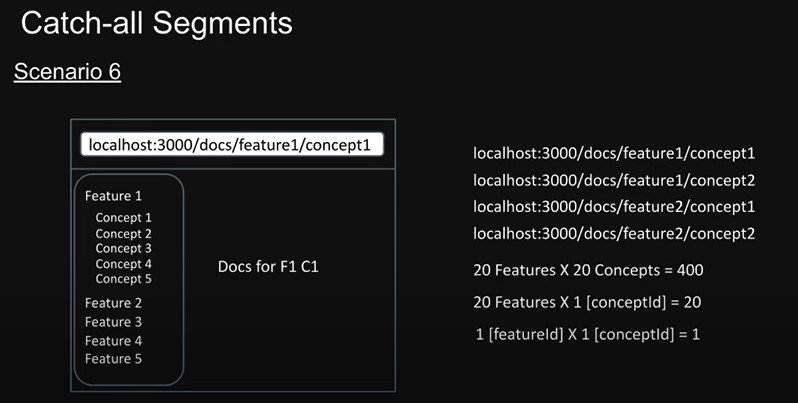

# Basic Routing (http://localhost:3001/about)

- All routes must be placed inside the app folder.
- Every file that corresponds to a route must be named page.js or page.tsx
Example :

u can simpley create a page.tsx file in src\app\about\page.tsx
when u navigate to http://localhost:3001/about, the ui should display About Page

# Nested Routes (http://localhost:3001/blog/first)

- Create a file in src\app\blog\first\page.tsx.
- add some code in it and navigate to http://localhost:3001/blog/first
- the ui should display First Blog

# Dynamic Routes (http://localhost:3001/products/1)

- Create a file in src\app\products\[productId]\page.tsx
- Add some code to it
```
export default function ProductDetail() {
  return <h1>Detail Product Page</h1>;
}
```
- When u open http://localhost:3001/products/1, the ui should display Detail Product Page.
- U can change the number in the url and there will be no errors
- Change the code to the following
```
export default function ProductDetail({
  params,
}: {
  params: {
    productId: string;
  };
}) {
  return <h1>Detail Product Page {params.productId}</h1>;
}

```
- When u open http://localhost:3001/products/1, the ui should display Detail Product Page 1.
- The params is a object that contains the id of the product.

# Nested Dynamic Routes (http://localhost:3001/products/1/reviews/1)

- Create a file in src\app\products\[productId]\reviews\[reviewId]\page.tsx
- Add some code to it
```
export default function ReviewDetail({
  params,
}: {
  params: {
    productId: string;
    reviewId: string;
  };
}) {
  return (
    <h1>
      Review {params.reviewId} for product {params.productId}
    </h1>
  );
}

```
- When u open http://localhost:3001/products/1/reviews/1, the ui should display Detail Review Page.

# Catch All Segment

- Goals :


- Create a file in src\app\docs\[[...slug]]\page.tsx
- Add some code to it
```
export default function Docs({
  params,
}: {
  params: {
    slug: string[];
  };
}) {
  if (params.slug?.length === 2) {
    return (
      <h1>
        Viewing docs for feature {params.slug[0]} and concept {params.slug[1]}
      </h1>
    );
  } else if (params.slug?.length === 1) {
    return <h1>Viewing docs for feature {params.slug[0]}</h1>;
  }
  return <h1>Docs home page</h1>;
}
```
- The params is an array that contains the segments of the url.
- if u open http://localhost:3001/docs, it will shown Docs home page
- if u open http://localhost:3001/docs/routing, it will shown Viewing docs for feature routing
- if u open http://localhost:3001/docs/routing/catch-all-segment, it will shown Viewing docs for feature routing and concept catch-all-segment

# Not found page

- Create a file in src\app\not-found.tsx
- Add some code to it
```
export default function NotFound() {
  return <h1>Not Found</h1>;
}
```
- When u open http://localhost:3001/something, the ui should display Not Found
- Or u can costum the not found page on some folder by creating a file in 

## Costum not found page
- Create a file in src\app\products\[productId]\reviews\[reviewId]\not-found.tsx
- Add some code to it
```
export default function NotFound() {
  return (
    <div>
      <h2>Review Not found</h2>
    </div>
  );
}
```
- Back to your page.tsx and change the code to the following
```
import { notFound } from "next/navigation";

export default function ReviewDetail({
  params,
}: {
  params: {
    productId: string;
    reviewId: string;
  };
}) {

  if(parseInt (params.reviewId) > 1000) {
    notFound();
  }

  return (
    <h1>
      Review {params.reviewId} for product {params.productId}
    </h1>
  );
}
```
- This time when u open the link that have params review above 1000, it will directly go to the not found page
- Try http://localhost:3001/products/1/reviews/3000, and it will go to not found page